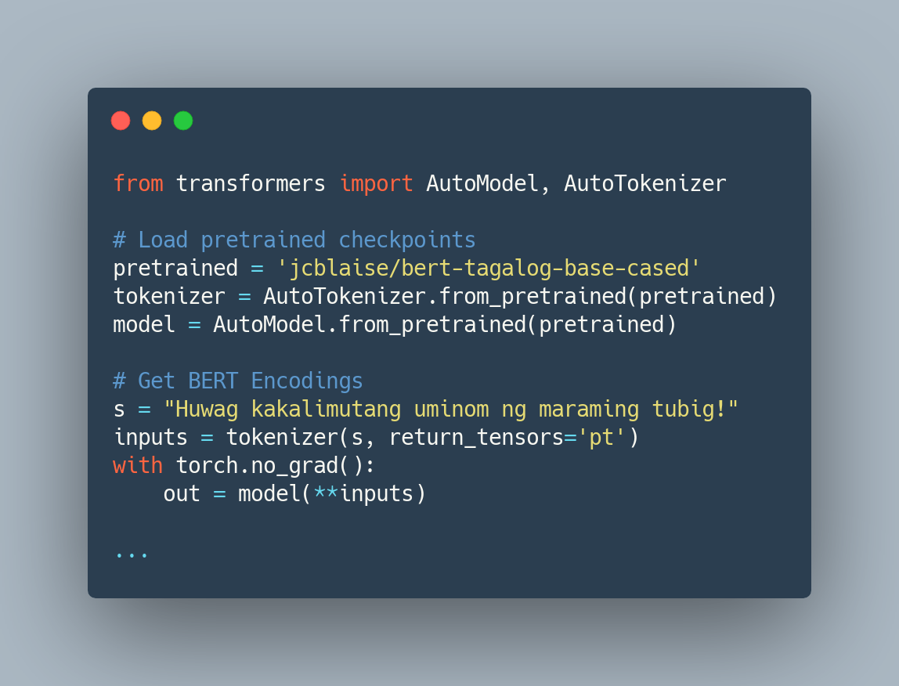

# Filipino-Text-Benchmarks
This repository contains open-source benchmark datasets and pretrained transformer models in the low-resource Filipino language.



Resources and code released in this repository come from the following papers, with more to be added soon:
1. Investigating the True Performance of Transformers in Low-Resource Languages: A Case Study in Automatic Corpus Creation [(Cruz et al., 2020)](https://arxiv.org/abs/2010.11574) 
1. Establishing Baselines for Text Classification in Low-Resource Languages [(Cruz & Cheng, 2020)](https://arxiv.org/abs/2005.02068)
2. Evaluating Language Model Finetuning Techniques for Low-resource Languages [(Cruz & Cheng, 2019)](https://arxiv.org/abs/1907.00409)

*This repository is a continuous work in progress!*

### Table of Contents

* [Requirements](https://github.com/jcblaisecruz02/Filipino-Text-Benchmarks#requirements)
* [Reproducing Results](https://github.com/jcblaisecruz02/Filipino-Text-Benchmarks#reproducing-results)
    * [Sentence Classification Tasks](https://github.com/jcblaisecruz02/Filipino-Text-Benchmarks#sentence-classification-tasks)
    * [Sentence-Pair Classification Tasks](https://github.com/jcblaisecruz02/Filipino-Text-Benchmarks#sentence-pair-classification-tasks)
    * [Logging Results](https://github.com/jcblaisecruz02/Filipino-Text-Benchmarks#logging-results)
* [Hyperparameter Search](https://github.com/jcblaisecruz02/Filipino-Text-Benchmarks#hyperparameter-search)
* [Released Datasets](https://github.com/jcblaisecruz02/Filipino-Text-Benchmarks#datasets)
* [Pretrained ELECTRA Models](https://github.com/jcblaisecruz02/Filipino-Text-Benchmarks#pretrained-electra-models)
* [Pretrained BERT Models](https://github.com/jcblaisecruz02/Filipino-Text-Benchmarks#pretrained-bert-models)
* [Other Pretrained Models](https://github.com/jcblaisecruz02/Filipino-Text-Benchmarks#other-pretrained-models)
* [Citations](https://github.com/jcblaisecruz02/Filipino-Text-Benchmarks#citations)
* [Contributing and Acknowledgements](https://github.com/jcblaisecruz02/Filipino-Text-Benchmarks#contributions-and-acknowledgements)

# Requirements
* PyTorch v.1.x
* [HuggingFace Transformers v.3.0.0](https://huggingface.co/transformers/index.html) (Note: Higher versions not thoroughly tested.)
* [Weight and Biases](https://www.wandb.com/) (Used for logging and hyperparameter search. Optional.)
* NVIDIA GPU (all experiments were done on Tesla P100 GPUs)

# Reproducing Results
First, download the data and put it in the cloned repository:

```bash
mkdir Filipino-Text-Benchmarks/data

# Hatespeech Dataset
wget https://s3.us-east-2.amazonaws.com/blaisecruz.com/datasets/hatenonhate/hatespeech_processed.zip
unzip hatespeech_processed.zip -d Filipino-Text-Benchmarks/data && rm hatespeech_processed.zip

# Dengue Dataset
wget https://s3.us-east-2.amazonaws.com/blaisecruz.com/datasets/dengue/dengue_processed.zip
unzip dengue_processed.zip -d Filipino-Text-Benchmarks/data && rm dengue_processed.zip

# NewsPH-NLI Dataset
wget https://s3.us-east-2.amazonaws.com/blaisecruz.com/datasets/newsph/newsph-nli.zip
unzip newsph-nli.zip -d Filipino-Text-Benchmarks/data && rm newsph-nli.zip
```

### Sentence Classification Tasks

To finetune for sentence classification tasks, use the ```train.py``` script provided in this repository. Here's an example finetuning a Tagalog ELECTRA model on the Hatespeech dataset:

```bash
export DATA_DIR='Filipino-Text-Benchmarks/data/hatespeech'

python Filipino-Text-Benchmarks/train.py \
    --pretrained jcblaise/electra-tagalog-small-cased-discriminator \
    --train_data ${DATA_DIR}/train.csv \
    --valid_data ${DATA_DIR}/valid.csv \
    --test_data ${DATA_DIR}/test.csv \
    --data_pct 1.0 \
    --checkpoint model.pt \
    --do_train true \
    --do_eval true \
    --msl 128 \
    --optimizer adam \
    --batch_size 32 \
    --add_token [LINK],[MENTION],[HASHTAG] \
    --weight_decay 1e-8 \
    --learning_rate 2e-4 \
    --adam_epsilon 1e-6 \
    --warmup_pct 0.1 \
    --epochs 3 \
    --seed 42
```

This should give you the following results: 
```
Valid Loss 0.4980
Valid Acc 0.7655
Test Loss 0.5243
Test Accuracy 0.7467
```

To perform multiclass classification, specify the label column names with the ```--label_column``` option. Here's an example finetuning a Tagalog ELECTRA model on the Dengue dataset:

```bash
export DATA_DIR='Filipino-Text-Benchmarks/data/dengue'

python Filipino-Text-Benchmarks/train.py \
    --pretrained jcblaise/electra-tagalog-small-uncased-discriminator \
    --train_data ${DATA_DIR}/train.csv \
    --valid_data ${DATA_DIR}/valid.csv \
    --test_data ${DATA_DIR}/test.csv \
    --label_columns absent,dengue,health,mosquito,sick \
    --data_pct 1.0 \
    --checkpoint model.pt \
    --do_train true \
    --do_eval true \
    --msl 128 \
    --optimizer adam \
    --batch_size 32 \
    --add_token [LINK],[MENTION],[HASHTAG] \
    --weight_decay 1e-8 \
    --learning_rate 2e-4 \
    --adam_epsilon 1e-6 \
    --warmup_pct 0.1 \
    --epochs 3 \
    --seed 42
```

This should give you the following results: 
```
Valid Loss 0.1574
Valid Acc 0.9462
Test Loss 0.1692
Test Accuracy 0.9341
```

For more information, run ```train.py --help``` for details on each command line argument.

### Sentence-Pair Classification Tasks

To finetune for sentence-pair classification (entailment datasets), you can specify the text column names using the ```--text_column``` option. Here's an example finetuning an uncased Tagalog ELECTRA model on the NewsPH-NLI dataset:

```bash
export DATA_DIR='Filipino-Text-Benchmarks/data/newsph-nli'

python Filipino-Text-Benchmarks/train.py \
    --pretrained jcblaise/electra-tagalog-small-uncased-discriminator \
    --train_data ${DATA_DIR}/train.csv \
    --valid_data ${DATA_DIR}/valid.csv \
    --test_data ${DATA_DIR}/test.csv \
    --text_columns s1,s2 \
    --data_pct 1.0 \
    --checkpoint model.pt \
    --do_train true \
    --do_eval true \
    --msl 128 \
    --optimizer adam \
    --batch_size 32 \
    --weight_decay 1e-8 \
    --learning_rate 2e-4 \
    --adam_epsilon 1e-6 \
    --warmup_pct 0.1 \
    --epochs 3 \
    --seed 45
```

This should give you the following results:
```
Valid Loss 0.1859
Valid Acc 0.9296
Test Loss 0.1894
Test Accuracy 0.9300
```

### Logging Results

We use [Weights & Biases](https://www.wandb.com/) to log experiment results. To use Weights & Biases, you need to toggle three command line arguments:

```bash
export DATA_DIR='Filipino-Text-Benchmarks/data/hatespeech'

python Filipino-Text-Benchmarks/train.py \
    --pretrained jcblaise/electra-tagalog-small-uncased-discriminator \
    ...
    --use_wandb \
    --wandb_username USERNAME \
    --wandb_project_name PROJECT_NAME

```

Replace ```USERNAME``` with your Weights & Biases username, and the ```PROJECT_NAME``` with the name of the project you're logging in to.

# Hyperparameter Search
To reproduce hyperparameter search results, you need to use the sweep function of [Weights & Biases](https://www.wandb.com/). For an example sweep, a ```sample_sweep.yaml``` file is included. This configuration sweeps for good random seeds on the Hatespeech dataset. Edit the file to your specifications as needed. For more information, check the [documentation](https://docs.wandb.com/sweeps/configuration).

To start a sweep, make sure to login first via the terminal, then run:

```bash
wandb sweep -p PROJECT_NAME Filipino-Text-Benchmarks/sample_sweep.yaml
```

This creates a sweep agent that you can run. Perform the sweep by running:

```bash
cd Filipino-Text-Benchmarks && wandb agent USERNAME/PROJECT_NAME/SWEEP_ID
```

where ```SWEEP_ID``` is the id generated by the ```wandb sweep``` command, and ```USERNAME``` is your W&B username. Make sure that you have the necessary data files in the ```data/``` folder inside the repository when running this example sweep.

# Datasets
* **NewsPH-NLI Dataset** [`download`](https://s3.us-east-2.amazonaws.com/blaisecruz.com/datasets/newsph/newsph-nli.zip)\
*Sentence Entailment Dataset in Filipino* \
First benchmark dataset for sentence entailment in the low-resource Filipino language. Constructed through exploting the structure of news articles. Contains 600,000 premise-hypothesis pairs, in 70-15-15 split for training, validation, and testing. Originally published in [(Cruz et al., 2020)](https://arxiv.org/abs/2010.11574).

* **WikiText-TL-39** [`download`](https://s3.us-east-2.amazonaws.com/blaisecruz.com/datasets/wikitext-tl-39/wikitext-tl-39.zip)\
*Large Scale Unlabeled Corpora in Filipino*\
Large scale, unlabeled text dataset with 39 Million tokens in the training set. Inspired by the original [WikiText Long Term Dependency dataset](https://blog.einstein.ai/the-wikitext-long-term-dependency-language-modeling-dataset/) (Merity et al., 2016). TL means "Tagalog." Originally published in [Cruz & Cheng (2019)](https://arxiv.org/abs/1907.00409).

* **Hate Speech Dataset** [`download`](https://s3.us-east-2.amazonaws.com/blaisecruz.com/datasets/hatenonhate/hatespeech_raw.zip)\
*Text Classification Dataset in Filipino* \
Contains 10k tweets (training set) that are labeled as hate speech or non-hate speech. Released with 4,232 validation and 4,232 testing samples. Collected during the 2016 Philippine Presidential Elections and originally used in Cabasag et al. (2019).

* **Dengue Dataset** [`download`](https://s3.us-east-2.amazonaws.com/blaisecruz.com/datasets/dengue/dengue_raw.zip)\
*Low-Resource Multiclass Text Classification Dataset in Filipino*\
Benchmark dataset for low-resource multiclass classification, with 4,015 training, 500 testing, and 500 validation examples, each labeled as part of five classes. Each sample can be a part of multiple classes. Collected as tweets and originally used in Livelo & Cheng (2018).

# Pretrained ELECTRA Models
We release new ELECTRA models in small and base configurations, with both the discriminator and generators available. All the models follow the same setups and were trained with the same hyperparameters as English ELECTRA models. Our models are available on HuggingFace Transformers and can be used on both PyTorch and Tensorflow. These models were released as part of [(Cruz et al., 2020)](https://arxiv.org/abs/2010.11574).

**Discriminator Models**

* ELECTRA Base Cased Discriminator - [`jcblaise/electra-tagalog-base-cased-discriminator`](https://huggingface.co/jcblaise/electra-tagalog-base-cased-discriminator) 
* ELECTRA Base Uncased Discriminator - [`jcblaise/electra-tagalog-base-uncased-discriminator`](https://huggingface.co/jcblaise/electra-tagalog-base-uncased-discriminator) 
* ELECTRA Small Cased Discriminator - [`jcblaise/electra-tagalog-small-cased-discriminator`](https://huggingface.co/jcblaise/electra-tagalog-small-cased-discriminator) 
* ELECTRA Small Uncased Discriminator - [`jcblaise/electra-tagalog-small-uncased-discriminator`](https://huggingface.co/jcblaise/electra-tagalog-small-uncased-discriminator)

**Generator Models**

* ELECTRA Base Cased Generator - [`jcblaise/electra-tagalog-base-cased-generator`](https://huggingface.co/jcblaise/electra-tagalog-base-cased-generator) 
* ELECTRA Base Uncased Generator - [`jcblaise/electra-tagalog-base-uncased-generator`](https://huggingface.co/jcblaise/electra-tagalog-base-uncased-generator) 
* ELECTRA Small Cased Generator - [`jcblaise/electra-tagalog-small-cased-generator`](https://huggingface.co/jcblaise/electra-tagalog-small-cased-generator)
* ELECTRA Small Uncased Generator - [`jcblaise/electra-tagalog-small-uncased-generator`](https://huggingface.co/jcblaise/electra-tagalog-small-uncased-generator)

The models can be loaded using the code below:

```Python
from transformers import TFAutoModel, AutoModel, AutoTokenizer

# TensorFlow
model = TFAutoModel.from_pretrained('jcblaise/electra-tagalog-small-cased-generator', from_pt=True)
tokenizer = AutoTokenizer.from_pretrained('jcblaise/electra-tagalog-small-cased-generator', do_lower_case=False)

# PyTorch
model = AutoModel.from_pretrained('jcblaise/electra-tagalog-small-cased-generator')
tokenizer = AutoTokenizer.from_pretrained('jcblaise/electra-tagalog-small-cased-generator', do_lower_case=False)
```

# Pretrained BERT Models
We release four Tagalog BERT Base models and one Tagalog DistilBERT Base model. All the models use the same configurations as the original English BERT models. Our models are available on HuggingFace Transformers and can be used on both PyTorch and Tensorflow. These models were released as part of [Cruz & Cheng (2019)](https://arxiv.org/abs/1907.00409).

* BERT Base Cased - [`jcblaise/bert-tagalog-base-cased`](https://huggingface.co/jcblaise/bert-tagalog-base-cased) 
* BERT Base Uncased - [`jcblaise/bert-tagalog-base-uncased`](https://huggingface.co/jcblaise/bert-tagalog-base-uncased) 
* BERT Base Cased WWM - [`jcblaise/bert-tagalog-base-cased-WWM`](https://huggingface.co/jcblaise/bert-tagalog-base-cased-WWM) 
* BERT Base Uncased WWM - [`jcblaise/bert-tagalog-base-uncased-WWM`](https://huggingface.co/jcblaise/bert-tagalog-base-uncased-WWM) 
* DistilBERT Base Cased - [`jcblaise/distilbert-tagalog-base-cased`](https://huggingface.co/jcblaise/distilbert-tagalog-base-cased) 

The models can be loaded using the code below:

```Python
from transformers import TFAutoModel, AutoModel, AutoTokenizer

# TensorFlow
model = TFAutoModel.from_pretrained('jcblaise/bert-tagalog-base-cased', from_pt=True)
tokenizer = AutoTokenizer.from_pretrained('jcblaise/bert-tagalog-base-cased', do_lower_case=False)

# PyTorch
model = AutoModel.from_pretrained('jcblaise/bert-tagalog-base-cased')
tokenizer = AutoTokenizer.from_pretrained('jcblaise/bert-tagalog-base-cased', do_lower_case=False)
```

# Other Pretrained Models
* **ULMFiT-Tagalog** [`download`](https://github.com/danjohnvelasco/Filipino-ULMFiT)\
Tagalog pretrained AWD-LSTM compatible with v2 of the FastAI library. Originally published in [Velasco (2020)](https://arxiv.org/abs/2010.06447).

* **ULMFiT-Tagalog (Old)** [`download`](https://s3.us-east-2.amazonaws.com/blaisecruz.com/ulmfit-tagalog/models/pretrained-wikitext-tl-39.zip)\
Tagalog pretrained AWD-LSTM compatible with the FastAI library. Originally published in [Cruz & Cheng (2019)](https://arxiv.org/abs/1907.00409).

# Citations
If you found our work useful, please make sure to cite!

```
@article{cruz2020investigating,
  title={Investigating the True Performance of Transformers in Low-Resource Languages: A Case Study in Automatic Corpus Creation}, 
  author={Jan Christian Blaise Cruz and Jose Kristian Resabal and James Lin and Dan John Velasco and Charibeth Cheng},
  journal={arXiv preprint arXiv:2010.11574},
  year={2020}
}

@article{cruz2020establishing,
  title={Establishing Baselines for Text Classification in Low-Resource Languages},
  author={Cruz, Jan Christian Blaise and Cheng, Charibeth},
  journal={arXiv preprint arXiv:2005.02068},
  year={2020}
}

@article{cruz2019evaluating,
  title={Evaluating Language Model Finetuning Techniques for Low-resource Languages},
  author={Cruz, Jan Christian Blaise and Cheng, Charibeth},
  journal={arXiv preprint arXiv:1907.00409},
  year={2019}
}
```

# Contributions and Acknowledgements
Should you find any bugs or have any suggestions, feel free to drop by the Issues tab! We'll get back to you as soon as we can.

*This repository is managed by the De La Salle University Machine Learning Group*


